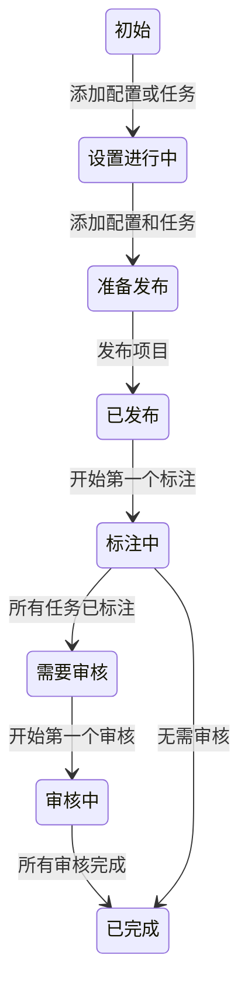
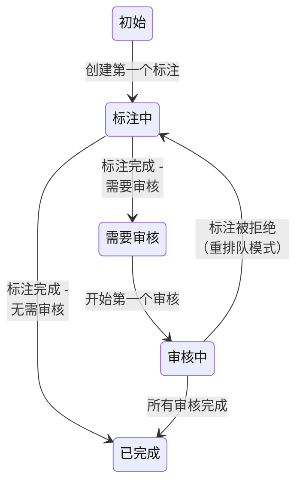

项目和任务在从初始创建状态到完成的过程中经历一系列状态。

!!! note
    请注意，状态变更历史跟踪直到为您的组织实现状态管理后才开始记录。对于大多数 Label Studio Cloud 组织，状态管理于 2026 年 2 月实施。

## 项目状态

项目经历以下状态：

| 状态 | 描述 |
|-----------|---------|
| **初始（Initial）** | 您已创建项目，但尚未创建任务或配置标注界面。 |
| **设置进行中（Setup In Progress）** | 您已创建项目，并且已创建任务或配置了标注界面，但尚未完成两者。  如果您的项目位于个人沙盒中，则在将其移至共享工作区之前无法超越此状态。 |
| **准备发布（Ready to Publish）** | 您的项目有任务且您已配置标注界面，但尚未发布项目。 |
| **已发布（Published）** | 项目已发布，但尚没有任何标注。 |
| **标注中（Annotating）** | 至少有一个任务至少有 1 个已提交的标注，意味着标注工作已开始。 |
| **需要审核（Needs Review）** | 所有任务已被所需数量的用户标注，但仍有任务需要审核。  您的项目是否进入此状态取决于您的项目设置和任务状态。请参见下文的[附加说明](#附加说明)。 |
| **审核中（In Review）** | 所有任务至少收到一个审核，但并非所有任务的审核都已全部完成。  您的项目是否进入此状态取决于您的项目设置和任务状态。请参见下文的[附加说明](#附加说明)。 |
| **已完成（Done）** | 所有任务已完成。 |

## 任务状态

| 状态 | 描述 |
|----------|------------|
| **初始（Initial）** | 任务已创建但尚没有任何标注。 |
| **标注中（Annotating）** | 第一个标注已提交，或被拒绝的标注已重新排队返回给标注员。  任务在此状态停留的时间是否足够长以反映在数据管理器中，取决于您的项目设置。请参见下文的[附加说明](#附加说明)。|
| **需要审核（Needs Review）** | 所需数量的标注已完成，任务已准备好进行审核。  任务是否进入此状态取决于您的项目设置。请参见下文的[附加说明](#附加说明)。 |
| **审核中（In Review）** | 任务中任何标注的第一个审核已创建。  任务是否进入此状态取决于您的项目设置。请参见下文的[附加说明](#附加说明)。|
| **已完成（Done）** | 所有必需的标注和审核已完成。 |

!!! info 提示
    您可以在数据管理器中点击状态来查看状态变更历史：

    

## 附加说明

### 项目设置与状态

若干项目设置会影响项目/任务是否以及如何进入某些状态。

##### 标注中状态

任务的**标注中**状态受[**质量 > 标注重叠数**](project_settings_lse#overlap)影响。

如果您的重叠数为 `1`，任务会在第一个标注提交后立即进入下一个状态。

如果您的重叠数大于 `1`，任务将保持在**标注中**状态，直到达到所需的标注数量。

##### 需要审核状态

有若干设置可能导致任务（以及相应地，项目）跳过**需要审核**状态：

* 如果您启用了[**审核 > 审核选项 > 仅审核手动分配的任务**](project_settings_lse#reviewing-options)，但尚未分配任何审核员。
* 如果您的[**审核抽样**](project_settings_lse#review-sampling)设置配置为允许部分或全部任务绕过**需要审核**状态。

##### 审核中状态

任务的**审核中**状态（以及相应地，项目）仅在以下情况下发生：

* 任务有多个标注（意味着重叠数大于 1）。
* 启用了[**审核 > 审核选项 > 当所有标注均被审核时任务才算审核完毕**](project_settings_lse#reviewing-options)设置。

默认情况下，如果任务的任何一个标注已被接受/拒绝，整个任务即被视为已审核。在这些情况下，任务将在提交一个审核后直接从**需要审核**移至**已完成**。

如果启用了**当所有标注均被审核时任务才算审核完毕**，任务将在提交第一个审核后从**需要审核**移至**审核中**，然后在提交最后一个审核后移至**已完成**。

### 任务状态汇总为项目状态

一旦项目达到**已发布**状态，其后续状态由项目内任务的状态决定。

项目采用任务中**最不高级**的状态。

例如，如果您有 10 个任务：
* 1 个任务处于**标注中**状态
* 6 个任务处于**审核中**状态
* 3 个任务处于**已完成**状态

您的项目将处于**标注中**状态。

##### 初始状态例外

例外是**初始**状态。出于项目状态汇总的目的，**初始**状态的任务按**标注中**状态计算。

例如，如果您有 10 个任务：

* 5 个任务处于**初始**状态
* 5 个任务处于**审核中**状态

您的项目将处于**标注中**状态，即使您没有任何任务实际处于**标注中**状态。

### API 值

如果您正在使用 [SDK](https://api.labelstud.io/api-reference/introduction/getting-started)，各状态的 API 值如下。

项目：

| 项目状态 | API 值 |
|-----------|----------|
| **初始（Initial）** | `CREATED` |
| **设置进行中（Setup In Progress）** | `SETUP_IN_PROGRESS` |
| **准备发布（Ready to Publish）** | `READY_TO_PUBLISH` |
| **已发布（Published）** | `PUBLISHED` |
| **标注中（Annotating）** | `ANNOTATION_IN_PROGRESS` |
| **需要审核（Needs Review）** | `NEEDS_REVIEW` |
| **审核中（In Review）** | `REVIEW_IN_PROGRESS` |
| **已完成（Done）** | `COMPLETED` |

任务：

| 任务状态 | API 值 |
|----------|------------|
| **初始（Initial）** | `CREATED` |
| **标注中（Annotating）** | `ANNOTATION_IN_PROGRESS` |
| **需要审核（Needs Review）** | `NEEDS_REVIEW` |
| **审核中（In Review）** | `REVIEW_IN_PROGRESS` |
| **已完成（Done）** | `COMPLETED` |
